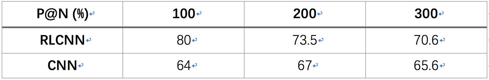
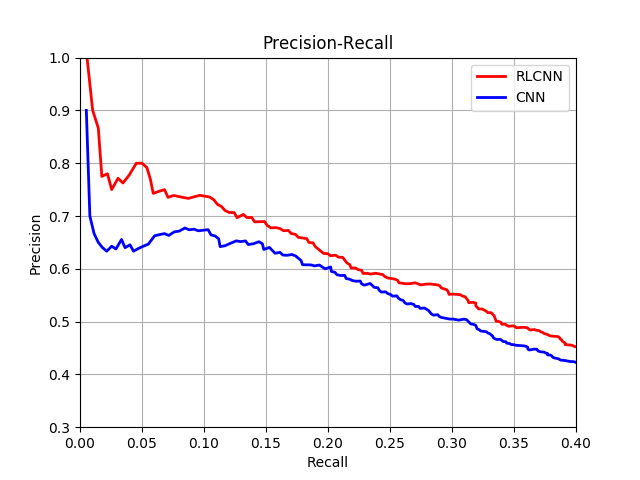

# Reinforcement Learning for Relation Classification from Noisy Data(TensorFlow)
Relation classification from noisy data, aiming to categorize semantic relations between two entities given a plain text with the automantically generated training data.The original [[code]](https://github.com/JuneFeng/RelationClassification-RL) of Reinforcement Learning for Relation Classification from Noisy Data is C++. This is a tensorflow version.

# Evaluation Results
P@N comparison between RLCNN and CNN:

Precision/Recall curve of RLCNN and CNN:

# Data
We use the same dataset(NYT10) as in [Lin et al.,2016]. And we provide it in origin_data/ directory.

Pre-Trained Word Vectors are learned from New York Times Annotated Corpus (LDC Data LDC2008T19), which should be obtained from [[data]](https://catalog.ldc.upenn.edu/LDC2008T19). And we provide it also in the origin_data/ directory.

Entity embedding are randomly initialized. The number of entities in the entity embedding should be the same with the number of entities in train.txt

To run our code, the dataset should be put in the folder origin_data/ using the following format, containing five files

- train.txt: training file, format (fb_mid_e1, fb_mid_e2, e1_name, e2_name, relation, sentence).
- test.txt: test file, same format as train.txt.
- relation2id.txt: all relations and corresponding ids, one per line.
- vec.txt: the pre-train word embedding file
- entity_ebd.npy: the entity embedding file.

# Codes
The source codes are in the current main directory. **cnnmodel.py** contains the original CNN model. **rlmodel.py** contains the RL model needed to be pre-trained . **cnnrlmodel.py** jointly trains the instance selector and relation classifier.

# Requirements
- Python (>=3.6.1)
- TensorFlow (=1.6.0)
- Matplotlib
- tqdm

# Initialize

Before you train your model, you need to type the following command:

	python initial.py
The program will transform the original data into .npy files for the input of the models. The .npy files will be saved in data/ directory.

# Train
For training the CNN model, you need to type the following command:

	python cnnmodel.py
The CNN model file will be saved in folder model/

For training the RL model with the CNN model fixed, you need to type the following command:

	python rlmodel.py
The RL model file will be saved in folder rlmodel/. Then the program will use the RL model to select the instance from the original training data and use the selected data to train a CNN model.

For jointly training the CNN and RL model, you need to type the following command:

	python cnnrlmodel.py
The jointly trained model will be saved in model/ and rlmodel/.

# Test
For testing, you need to type the following command:

	python test.py
The P@N results will be printed and the PR curve data will be saved in data/. You can type the command:

	python plot_pr.py
The program will plot the PR curve.

The models in the model/ and rlmodel/ folders are the best models We have trained. You could use them to select instance from training data and do the test.

# Reference

[Lin et al., 2016] Yankai Lin, Shiqi Shen, Zhiyuan Liu, Huanbo Luan, and Maosong Sun. Neural Relation Extraction with Selective Attention over Instances. In Proceedings of ACL.

[Feng et al. 2016] Jun Feng, Minlie Huang, Li Zhao, Yang Yang, and Xiaoyan Zhu. Reinforcement Learning for Relation Classification from Noisy Data. In AAAI2018.

https://github.com/thunlp/TensorFlow-NRE

https://github.com/JuneFeng/RelationClassification-RL

https://medium.com/emergent-future/simple-reinforcement-learning-with-tensorflow-part-1-5-contextual-bandits-bff01d1aad9c
